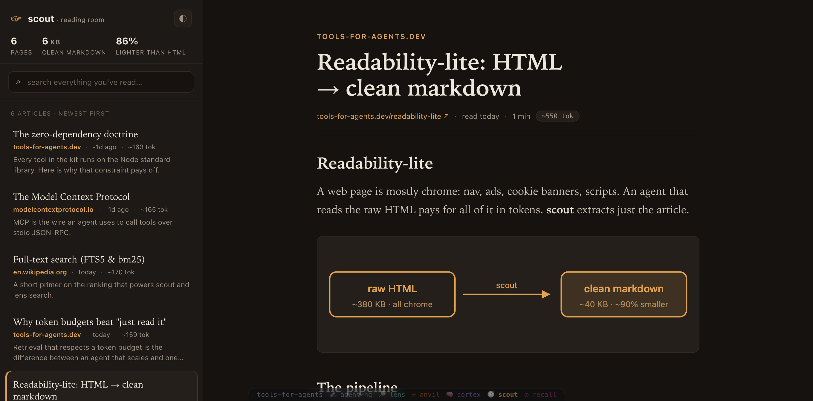

# 🧭 scout

[](https://github.com/tools-for-agents/scout/actions/workflows/ci.yml)

**The agent's web reader.**

Raw HTML is a terrible thing to feed a model — a 380 KB Wikipedia page is ~95k tokens of markup for a few KB of prose. `scout` fetches a URL and gives back **clean, readable markdown** (headings, links, code, lists — the substance, none of the chrome), typically **~90% smaller** than the HTML. Every page is **cached**, so re-reading is free and your **whole reading history is searchable**.

Part of [`tools-for-agents`](https://github.com/tools-for-agents). **Zero dependencies** — Node's built-in `fetch` + a regex "readability-lite" extractor + `node:sqlite` (FTS5). Pairs naturally with [`cortex`](../cortex): scout clips the web, cortex files it into your second brain.

---

## Why

| Without scout | With scout |
|---|---|
| Feed raw HTML to the model → ~95k tokens of `<div>`s | `scout_fetch` → ~5k tokens of clean prose |
| Re-fetch the same page every time you need it | Cached — re-reads are free (`--fresh` to bust) |
| "What did that article say about X?" → fetch again, re-read | `scout_search "X"` across everything you've read |
| No memory of what you've researched | A searchable reading history on disk |

## CLI

```bash
scout fetch https://en.wikipedia.org/wiki/Zettelkasten     # → clean markdown (cached)
scout fetch https://example.com/post --tokens 3000         # cap the returned size
scout fetch https://api.example.com/data.json --raw        # skip extraction
scout search "luhmann note linking" -k 5                   # search your reading history
scout links https://news.ycombinator.com --limit 30        # outbound links to crawl next
scout list | scout forget https://old.example.com | scout stats
scout serve                                                # → reading-room web view :7950
```

Cache location: `$SCOUT_DB` (default `./.scout/cache.db`).

## Reading room (`scout serve`)



```bash
scout fetch https://en.wikipedia.org/wiki/Zettelkasten     # read a few pages…
scout serve                                                # → http://localhost:7950  (--port to change)
```

A calm, zero-dependency web view of everything scout has read — the same cache the agent recalls from:

- **The shelf** — every cached page as a card (title, source, when it was read, `~token` size), newest first.
- **Search** your whole reading history (FTS5 + bm25) with matched terms highlighted.
- **The reader** — clean, comfortable long-form: the extracted markdown rendered with real typographic hierarchy (including **images**), in a **paper** or **night** theme.
- Read-only and **cache-only** — the web view never touches the network; `/api/page` returns 404 for anything not already read.

Try the demo without a network fetch: `node scripts/seed.js` then `scout serve`.

## MCP server (for agents)

```jsonc
{
  "mcpServers": {
    "scout": { "command": "node", "args": ["/abs/path/to/scout/mcp/mcp-server.js"],
               "env": { "SCOUT_DB": "/abs/path/to/.scout/cache.db" } }
  }
}
```

### Tools

| Tool | Use it to… |
|---|---|
| `scout_fetch` | Read a web page as clean, token-budgeted markdown (cached; `fresh` to re-fetch). |
| `scout_search` | Search every page you've already read — ranked snippets, no re-fetch. |
| `scout_links` | Extract a page's outbound links (absolute URLs + text) to decide where to go next. |
| `scout_list` | Your recent reading history. |
| `scout_forget` | Drop a page from the cache. |
| `scout_stats` | Pages cached, bytes stored, last fetch. |

### The research loop (with cortex)

1. `scout_fetch` the page → clean markdown.
2. `scout_search` your history to connect it to what you've already read.
3. `cortex_capture` the useful parts into your second brain, then `cortex_write` distilled, `[[linked]]` notes.
4. Next time, `cortex_search` / `scout_search` recall it instead of fetching the web again.

## How it works

- **Fetch** uses Node's global `fetch` (follows redirects, 20 s timeout, a plain user-agent).
- **Extraction** is regex-based readability-lite: strip `<script>/<style>/<nav>/<footer>/…`, pick the densest `<article>`/`<main>`/`<body>` region, convert headings, links (resolved to absolute), **content images** (``/`<figure>` → markdown, tracking pixels dropped), code, lists, bold/italic, and decode HTML entities. Not a full DOM parse — but it reliably turns an article into readable prose at a fraction of the tokens.
- **Cache** is a `node:sqlite` table keyed by URL; the same URL returns instantly unless `fresh`. An FTS5 mirror makes the whole history searchable by **bm25**, filled to a token budget (≈4 chars/token) — the same discipline as [`lens`](../lens) and [`cortex`](../cortex).
- Non-HTML responses (JSON, plain text) are stored verbatim.
